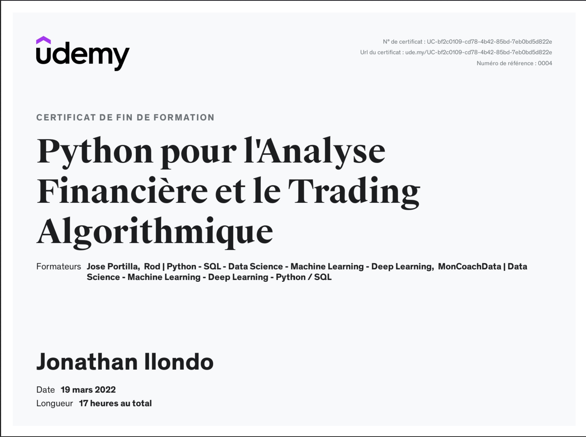

# Backtest DCA vs Lump Sum — ETF Amundi MSCI World (CW8)

Simulations réalisées dans le cadre du mini-mémoire UAEF04, Licence Analyse Économique et Financière (LG043), 
CNAM Paris — Année universitaire 2025-2026.

## Sujet du mémoire

**"Le Dollar-Cost Averaging : mythe ou réalité pour l'investisseur 
particulier français ?"**

## Contenu

Deux backtests comparant la stratégie DCA (500€/mois) à 
l'investissement en une seule fois (lump sum) sur l'ETF Amundi 
MSCI World (CW8.PA, ISIN : LU1681043599) :

- **Période haussière** : janvier 2010 — décembre 2019
- **Période de crise** : janvier 2019 — décembre 2023

## Données

Cours mensuels (Close) téléchargés via la bibliothèque Python 
`yfinance` depuis Yahoo Finance.

## Exécution

```invite de commande
pip install yfinance pandas matplotlib
jupyter notebook
```

## Outils et apprentissage

Le code Python a été réalisé avec l'assistance de 
**Claude** (Anthropic) comme outil d'aide à la programmation.

Mes compétences en Python ont été acquises grâce à :

- **Livre** : Petite leçon de Python : Introduction pratique  et orientée projet
  
- **Formation Udemy** : Python pour l'analyse financière et le trading algorithmique

### Certificat de formation



## Auteur

Ilondo Jonathan — CNAM Paris, 2026
